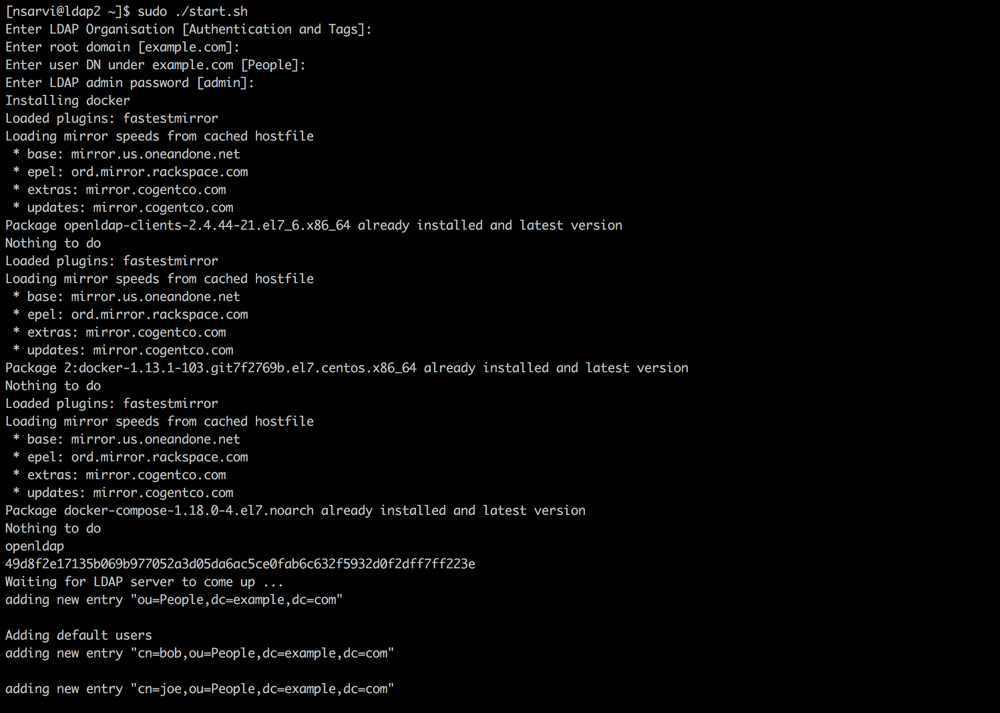
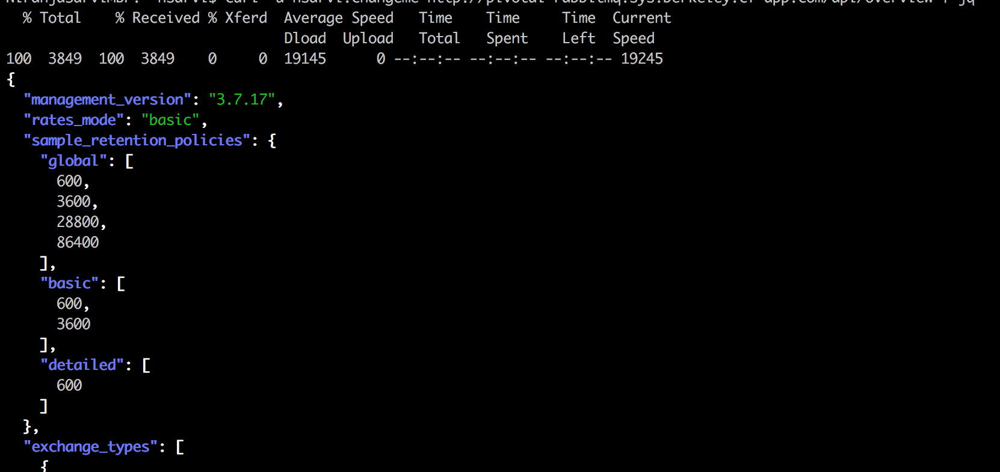

# Configure RabbitMQ for PCF with LDAP Authentication

In this scenario we will configure RabbitMQ for PCF so that users are authenticated against the LDAP and not against the internal RabbitMQ Database. The default user `guest:guest` wont be able to authenticate anymore. We can certainly configure RabbitMQ to use both, first LDAP and then the internal, but this is not the option we will configure at this time.

In this scenario, we are not going to configure authorization, i.e. users will be allowed to access any resource on any vhost.

No users will have the `administrator` *user tag* but all users will have the `management` tag. This is the role required to access the management plugin (console and/or api).

## Prerequisites to follow this guide
The following are the prerequisites:

- Access to PCF Ops Manager
- Pre-Provisioned Service instance and service key should be created
- Sudo root access to GCP VM where `OpenLDAP` server will be deployed
  
## Set up OpenLDAP

We chose to deploy [Pivotal Cloud Foundry](https://pivotal.io/platform) in [Google Cloud Platform](cloud.google.com‎). For this reason, we are going to deploy OpenLDAP in GCP too.

1. Login to GCP cloud console and create CentOS 7.x VM of type n1-standard-1 and 20 GB disk space.

2. Open the port `389` which is default ldap port.


From within the `only-authentication-4-pcf` folder, run `start.sh` script to launch **OpenLDAP** and create default users as below. 

```
sudo start.sh
```

This script prompt for root DN, base DN for users, LDAP admin password for customization. If inputs are not provided, the script will run with below defaults:
  - Root DN: `dc=example,dc=com`
  - Base DN for Users `ou=People,dc=example,dc=com` 
  - LDAP admin user `admin` and password `admin`.
  - Two users `bob` and `joe` with default password `changeme`

The result of the `start.sh` script 



At this point, `OpenLDAP` is running with two default users created.  To verify **OpenLDAP** is running, run the following command:

```
ldapsearch -x -LLL -s base -b "" namingContexts
```

If it works, it should return

```
dn:
namingContexts: dc=example,dc=com
```

Note with regard `start.sh`:
> We can run it as many times as want. If it was already running, it will kill it and start new one. This is so that we start with a clean LDAP database. If required, additional users needed to be imported by adding them to `users.ldif`

## 2. Brief Introduction to LDAP

For those who are new to LDAP, think of LDAP as a file system. On a file system, we create files and typically we create them under directories/subfolders. Similarly, in LDAP we create *objects* rather than files and those *objects* are created within a naming scheme similar to directories. In a file system, we can refer to a file by using its name (e.g. `Readme.md`) or by using its absolute path (`/home/bob/Readme.md`). Similarly, in LDAP an *object* has a name specified by the attribute `cn` (Common Name) but more importantly it has a unique and fully qualified name `dn` (Distinguised Name). For instance, the single user defined in our LDAP installation has the name `cn=admin` and its fully qualified name is `cn=admin,dc=example,dc=com`.

In terms of tree structure this is what it is like:

```
      dc=example, dc=com               <== Root DN
          |
          |
   cn=admin, dc=example, dc=com     <== Our admin user
```

Let's run a command that returns all the entries under `ou=People,dc=example,dc=com`:

```
ldapsearch -x -h localhost -b "ou=People,dc=example,dc=com"  -D "cn=admin,dc=example,dc=com" -w admin
```

From a remote/edge machine, run the same command as follows

```
ldapsearch -x -h <ldap-server-host/ip> -b "ou=People,dc=example,dc=com"  -D "cn=admin,dc=example,dc=com" -w admin
```

It returns user objects under `ou=People,dc=example,dc=com` as below

```
# bob, People, example.com
dn: cn=bob,ou=People,dc=example,dc=com
cn: bob
sn: martin
givenName: bob
uid: bob
uidNumber: 5000
gidNumber: 10000
homeDirectory: /home/bob
mail: bob@example.com
objectClass: top
objectClass: posixAccount
objectClass: shadowAccount
objectClass: inetOrgPerson
objectClass: organizationalPerson
objectClass: person
loginShell: /bin/bash
userPassword:: Y2hhbmdlbWU=

# joe, People, example.com
dn: cn=joe,ou=People,dc=example,dc=com
cn: joe
sn: martin
givenName: joe
uid: joe
uidNumber: 5002
gidNumber: 10000
homeDirectory: /home/bill
mail: joe@example.com
objectClass: top
objectClass: posixAccount
objectClass: shadowAccount
objectClass: inetOrgPerson
objectClass: organizationalPerson
objectClass: person
loginShell: /bin/bash
userPassword:: Y2hhbmdlbWU=
```


## 3. Create additional users in LDAP

Once we have LDAP running, we need to create users by adding users import the users `users.ldif` and importing to `LDAP`. 

create a file `users.ldif` and additional users as below 

```
 dn: cn=user1,ou=People,dc=example,dc=com
 cn: user1
 sn: lastname
 givenName: firstname
 uid: user1
 uidNumber: 5000
 gidNumber: 10000
 homeDirectory: /home/bob
 mail: user1@example.com
 objectClass: top
 objectClass: posixAccount
 objectClass: shadowAccount
 objectClass: inetOrgPerson
 objectClass: organizationalPerson
 objectClass: person
 loginShell: /bin/bash
 userPassword: {SHA}W6ph5Mm5Pz8GgiULbPgzG37mj9g=
```

Run the following command to create:

```
ldapadd -x -h localhost -p 389  -w admin -D "cn=admin,dc=example,dc=com" -f additional-users.ldif
```

From remote/edge machine

```
ldapadd -x -h <ldap-server-host/ip> -p 389  -w admin -D "cn=admin,dc=example,dc=com" -f additional-users.ldif
```

`additional-users.ldif` should follows LDAP format to define the objects we want to create.

SHA encoded version of password can be generated using : `slappasswd -h {SHA} -s password`


## 4. Enable LDAP plugin in RabbitMQ for PCF
Enable RabbitMQ LDAP plugin by following the below steps

1. Login to Ops Manager
2. Click  RabbitMQ tile  
3. Click Pre-Provisioned RabbitMQ
4. Check the `rabbitmq_auth_backend_ldap`  under `RabbitMQ plugins` as show in the below pic


## 5. Configure LDAP in RabbitMQ for PCF

There are various ways to configure RabbitMQ for authentication and authorization against LDAP.
The below steps represents 'only authentication' against LDAP and fallback to internal database.

### 5.1. Prepare LDAP configurations

The following configurations represents only authentication against LDAP and fallback to internal database.


```
rabbit-auth.config

[
    {rabbit, [
        {auth_backends, [rabbit_auth_backend_ldap, rabbit_auth_backend_internal]}
    ]},
    {rabbitmq_auth_backend_ldap, [
        {servers,               ["<ldap-server-host>"]},
        {user_dn_pattern,       "cn=${username},ou=People, dc=datatx,dc=pivotal,dc=io"},
        {tag_queries, [
            {administrator,     {constant, false}},
            {management,        {constant, true}}            
        ]},
        {log, network}
    ]}
].


```

For various scenarios on authentication and authorizing resources (vhosts, exchanges, queues), prepare LDAP configurations as mentioned in [RabbitMQ integration with LDAP](README.md)


### 5.2. Convert to Base64

Convert the above configurations to Base64 encoding using openssl.

```shell
openssl base64 -in rabbit-auth.config -out rabbit-auth-base64.config
```

### 5.3. Update RabbitMQ configurations

Update the Base64 LDAP configurations onto `RabbitMQ Configuration` field on the RabbitMQ tile.

1. Login to Ops Manager
2. Click  RabbitMQ tile  
3. Click Pre-Provisioned RabbitMQ
4. Update RabbitMQ Configuration field with Base64 encoding


5. Save and apply changes

### 6. Verify LDAP user can log in

```shell
curl -u bob:changeme <pcf-rabbitmq-http-api-uri>/overview | jq
```

This should return as below




LDAP users can log-in to RMQ management UI using LDAP credentials.
