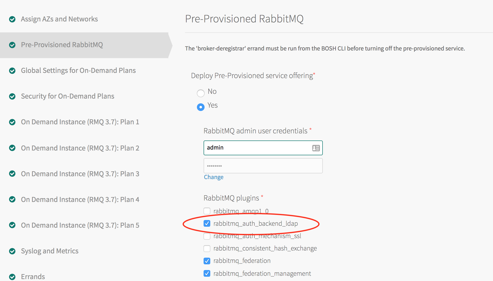
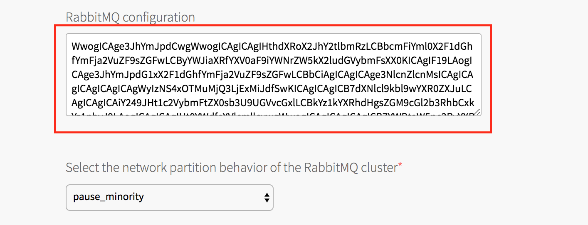

# Configure RabbitMQ for PCF with LDAP Authentication

This guide demonstrates how to set up RabbitMQ for PCF to authenticate and authorize via the LDAP plugin. It starts with a very simple scenario 'Only Authentication', which just configures RabbitMQ to authenticate users via LDAP.

For further configuring RabbitMQ with LDAP to secure vhost access, secure resource (i.e. *exchanges* and *queues*) access and management plugin access, follow the similar steps mentioned in [RabbitMQ integration with LDAP](README.md)

As of RabbitMQ for PCF v1.17, LDAP configuration is supported on Pre-Provisioned Service. LDAP configuration for On-Demand Service is planned to release in future versions.

# Prerequisites to follow this guide
The following prerequisites to follow the the below steps

- Access to PCF Ops Manager
- Pre-Provisioned Service instance and service key should be created
- `LDAP server` installed and configured as mentioned in [Only Authentication](only-authentication/README.md)
- 'LDAP server' port 389 (default) or any configured port should be open 
- `ldapsearch` and `ldap-utils` package should be installed on local/edge machine  


# LDAP users setup

`LDAP server` is configured with the following structure

Base DN for users
```
ou=People,dc=datatx,dc=pivotal,dc=io
```

Base DN for user groups

```
ou=Group,dc=datatx,dc=pivotal,dc=io
```

Create users in ldap

Create a rabbitmq-users.ldif with the following contents

```
# user1
dn: cn=nsarvi,ou=People,dc=datatx,dc=pivotal,dc=io
cn: Niranjan
sn: Sarvi
objectClass: inetOrgPerson
userpassword: f1NTSEF9MlYwbnzwZWVwZmJPazJjTHRUbUcwMXdDTE5nNDAwR2E=
uid: nsarvi
mail: nsarvi@pivotal.io

# user2
dn: cn=mrosales,ou=People,dc=datatx,dc=pivotal,dc=io
cn: Marcial
sn: Rosales
objectClass: inetOrgPerson
userpassword: f1NTSEF9MlYwbnzwZWVwZmJPazJjTHRUbUcwMXdDTE5nNDAwR2E=
uid: mrosales
mail: mrosales@pivotal.io

```

Add the users to `ldapserver`

```
ldapadd -h <ldap-server-host> -p <ldap-port> -D "cn=ldapadm,dc=datatx,dc=pivotal,dc=io" -w  -f rabbitmq-users.ldif

```

# Enable LDAP plugin 
Enable RabbitMQ LDAP plugin by following the below steps

1. Login to Ops Manager
2. Click  RabbitMQ tile  
3. Click Pre-Provisioned RabbitMQ
4. Check the `rabbitmq_auth_backend_ldap`  under `RabbitMQ plugins` as show in the below pic



# Configure LDAP 

There are various ways to configure RabbitMQ for authentication and authorization against LDAP. 
The below steps represents the only authentication against LDAP and then fallback to internal database.

## 1. Prepare LDAP configurations

The following configurations represents only authentication against LDAP and fallback to internal database.


```
rabbit-auth.config

[
    {rabbit, [
        {auth_backends, [rabbit_auth_backend_ldap, rabbit_auth_backend_internal]}
    ]},
    {rabbitmq_auth_backend_ldap, [
        {servers,               ["<ldap-server>"]},
        {user_dn_pattern,       "cn=${username},ou=People, dc=datatx,dc=pivotal,dc=io"},
        {tag_queries, [
            {administrator,     {constant, true}},
            {management,        {constant, true}}            
        ]},
        {log, network}
    ]}
].


```

For various scenarios on authentication and authorizing resources (vhosts, exchanges, queues), prepare LDAP configurations as mentioned in [RabbitMQ integration with LDAP](README.md)
 

## 2. Convert to Base64

Convert the above configurations to Base64 encoding using openssl.

```
openssl base64 -in rabbit-auth.config -out rabbit-auth-base64.config
```

## 3. Update RabbitMQ configurations

Update the Base64 LDAP configurations onto `RabbitMQ Configuration` field on the RabbitMQ tile.

1. Login to Ops Manager
2. Click  RabbitMQ tile  
3. Click Pre-Provisioned RabbitMQ
4. Update RabbitMQ Configuration field with Base64 encoding





5. Save and apply changes

## 4. Verify LDAP user can log in 

```
curl -u nsarvi:<password> <pcf-rabbitmq-http-api-uri>/overview | jq
```


LDAP users can log-in to RMQ management UI as well. 